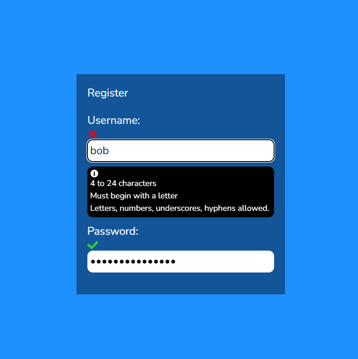
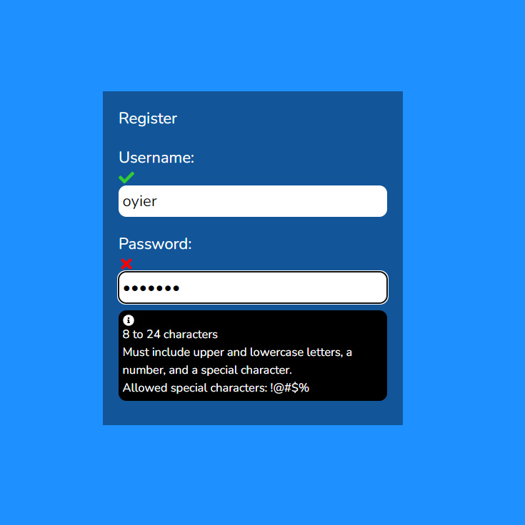

# FORM LOGIN, REGISTRATION AND AUTHORIZATION.

Add user login and registration to your React app.
Also learn how to apply role-based permissions and routing, and incorporate JWT access and refresh tokens for secure and continuous authentication.

## Tutorial by Dave Gray.

[FULL PLAYLIST HERE](https://www.youtube.com/playlist?list=PL0Zuz27SZ-6PRCpm9clX0WiBEMB70FWwd)

## Authors

Project contributed to and maintained by:

- [Bob Oyier](https://github.com/oyieroyier/)

### ISC License (ISC)

